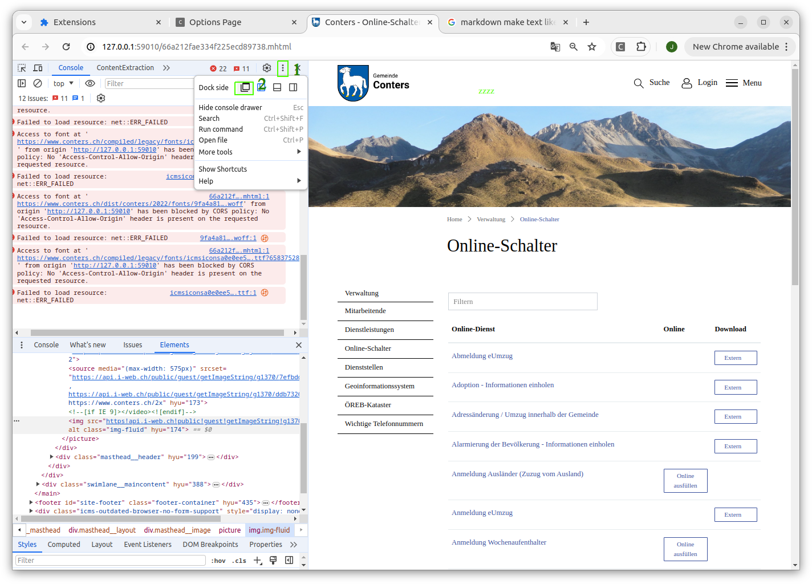

# Webpage Segmentation Curation 
This project is a modified version of https://github.com/dreamwayjgs/main-content-extraction-assessment-framework/tree/main. The original code has been adapted and tailored for specific use.

# Changes from the [Original Code](https://github.com/dreamwayjgs/main-content-extraction-assessment-framework/tree/main)
The main changes from the original code include:

- Crawling Mode
    - added processing of links in MHTML
    - added scrowl down, and wait for whole page is loaded befor crawling

- Curation Mode
    - Different Segmentation Classes: Functional and Maturity Classes
    - Saving the bounding box of the curated Segments
    - Overlay of added segments with option to delete the segment
    - Automatically adding header, footer if same domain was already curated.

# WebExtension

 A WebExtension based framework for the assessment of Main Content Extraction Methods from web pages. This framework provides four steps to assess the main content extraction methods:
   1. Crawling web pages
   1. Curation: Annotating and labeling web pages.
   1. Extraction: Run the main content extraction methods on the web pages.
   1. Evaluation: Evaluate the extraction result by comparing with the ground truth.

 This repository contains the framework with the demo backend server (in <code>/project/api</code> folder).

# Quickstart
## Open Chrome
Open chrome with disabled web security, such that it can load all fonts and images.

Linux: <code>google-chrome --disable-web-security --user-data-dir="/tmp/chrome"</code>  
Windows:     <code>"C:\Program Files\Google\Chrome\Application\chrome.exe" --disable-web-security --user-data-dir="C:\tmp\chrome"</code>
## Install extension
1. Go to [chrome extension](chrome://extensions/)
2. Turn Developer mode on (top right of screen)
3. Load unpacked extension and select the <code>dist</code> folder in <code>chrome_extension</code> folder
4. Select the extension and go to <code>Options</code>
5. FIRST TIME ONLY: Reload the extension using the button: ↻


# Usage 
Check that you are in the ZHAW Network.
## Options 

1. Open <code>background_page</code> 
(Console will show logs)
Open the DevTools in a seperate Window! 

    Dev tools to seperate Window:

    

    Select Console to watch logs: 
    
    


2. Go to the Options of the Chrome Extension


3. Reset to default and enter your userId
4. Add Webpages to mongodb 
    1. open [mongo express](http://localhost:59002)
    2. Go to [maincontent/webpages](http://localhost:59002/db/maincontent/Webpage)
    3. Import --mongoexport json, and choose File like 'muni_201_400.json'
5. Refresh (sources should now show)

## Different Tasks
### Curation 
After Crawling you can label the websites.

Options:

    curation: 
        startLastCurated: true
        addBoundingBoxes: true
        auto: true
        showAllUsers: false
    
StartLastCurated: go to Page with the last curated segments (default: true), page is looked at as curated when it has 3 or more labeled segments
showAllUsers:   will show curated segments of all Users (default: false)
addBoundingBoxes: will get the boundingbox and add it in the database (only do on big display width larger than 2575)
auto: will go through all pages automatically, (use with addBoundingBoxes to get all)

For Labeling on smaller displays or without getting BoundingBox use: 

    curation: 
        startLastCurated: true
        addBoundingBoxes: false

For getting all labeled Boundingboxes use: 

    curation: 
        startLastCurated: false
        addBoundingBoxes: true
        auto: true

For looking at other Users answers:

    curation: 
        startLastCurated: false
        addBoundingBoxes: false
        showAllUsers: true

1. After pressing Curation link, Open Dev Tools to the Side. (Right Click in page / Inspect or Ctrl+Shift+C)
2. Open ContentExtraction (Maybe search in >> symbol for the tab)
3. Select Node, Use the symbol to activate it or (Ctrl+Shift+C), then select a node
    
4. Label the selected node using the Buttons.
5. Go to Next Page <code>Ctr+Shift+Right Arrow (→)</code> or <code>Right Click in page /Content Extraction Manager Template/ Inspect Pages / Next 'number' </code>  
If the shortcuts aren't working, got to the Extension and then to Keyboard shortcuts. Add your shortcuts for next and prev page.
(If there are to Next Buttons, two curations where started, reload the Chrome Extension ([chrome extension](chrome://extensions/)) to remove it. Just press the circle arrow.)

### Crawl
1. Add options: 
    ```
    crawl: 
        watch: true
        auto: true
    ```
    
    
2. When Starting crawl, you can choose to only crawl certain index, if not just cancel or enter nothing.
(First time only not allowed to use index (Initializing Database))

3. > **Warning**  
    > Do not click into any other chrome page while crawling. (Other Applications are fine.)
    
# Installation and running locally
## Install first Time
We recommand [VSCode Remote Containers feature](https://code.visualstudio.com/docs/remote/containers) to use this framework. Or you need [nodejs](https://nodejs.org/en/download/) >= 14.

### Instructions VSCode + Docker
#### 1. Run docker containers in src folder
```
docker-compose up
```
#### 2. Run VSCode remote containers
- Open VSCode in root directory
- Click on "Open a Remote Window" in the botton right conner.

    

- Select "Open Folder in Container..." in the dropdown menu.


- Select the "node" folder in root directory and click "open" in the dialog box. (Click open button, NOT doubleclick folder.)


#### 3. In the node Container run: In folder api

1. Install dependencies
```
yarn
```
2. Initialize database
```
yarn db-init
```
3. Start the server
```
yarn start
yarn restart # Restart if server is already running
```
5. Logs
```
yarn pm2 log 0
```

#### 4. In the node Container run: Build Chrome Extension and add Chrome Extension to ChromeBrowser

1. Install dependencies (in chrome_extension folder)
```
yarn
```
2. build the extension (unpacked extension created in <code>dist</code> folder)
```
yarn build
```
3. Install extension
    1. Go to [chrome extension](chrome://extensions/)
    2. Turn Developer mode on (top right of screen)
    3. Load unpacked extension and select the <code>dist</code> folder in <code>chrome_extension</code> folder

## Upload new data
1. Convert csv to json 

    source_name: The name it will show in the list of the chrome extension
    url_column: The column of the df where the urls are.
    
    ```
    import pandas as pd
    
    def csv_to_json_mongo_export(file, url_column, source_name):
        df = pd.read_csv(file)
        df['source'] = source_name
        df['url'] = df[url_column]
        df_to_json = df[['url', 'source']]
        df_to_json.to_json(file[:-4] + '.json', orient='records')
    ```

2. Upload using mongoexport  
- go to http://<ip_adress>:59002/db/maincontent/Webpage
- Use Button "Import --mongoexport json" and select the json file

